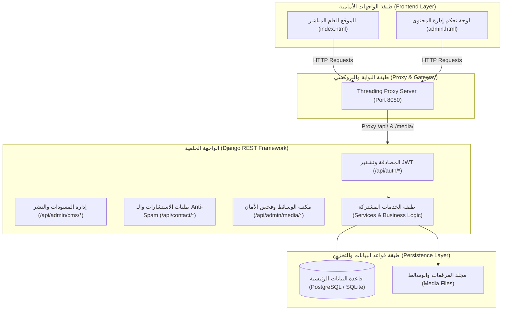

# 🏢 منظومة شركة أساسات المشاعر المحدودة (Asasat Al-Mashaer Co. Ltd.)
### Full-Stack Enterprise Platform & Dynamic Headless CMS

منظومة رقمية مؤسسية متكاملة لـ **شركة أساسات المشاعر المحدودة** (س.ت: `4031245678` | رقم ضريبي: `310245678900003`)، الرائدة في تصميم وتوريد وتركيب وتشغيل الأنظمة الأمنية الذكية، البنية التحتية للشبكات والاتصالات، إنذار الحريق المعتمد، وإدارة المباني BMS في المملكة العربية السعودية.

---

## 🌟 نظرة عامة على المعمارية البرمجية (System Architecture)

تم بناء النظام وفق أرقى معايير هندسة البرمجيات النظيفة (**Clean Architecture**):



---

## 🛠️ الميزات والقدرات التقنية المنجزة

### 1️⃣ **بيانات وهوية مؤسسية واقعية 100% (Real Enterprise Data):**
- **الخدمات الـ 10 الهندسية المعتمدة:**
  1. أنظمة الأمان والمراقبة الذكية (AI CCTV) المعتمدة من HCIS.
  2. أنظمة التحكم بالدخول والخروج البيومترية (Access Control).
  3. أنظمة الإنذار المبكر والنداء العام (PA/VA).
  4. أنظمة كشف وإنذار الحريق المعتمدة (UL/FM & NFPA 72).
  5. البنية التحتية للشبكات والألياف الضوئية (10Gbps Fiber & CITC).
  6. الأنظمة الصوتية الذكية والمعالجة الرقمية (DSP Pro Audio).
  7. السنترالات الرقمية والاتصالات الموحدة (IP-PBX & VoIP).
  8. أنظمة إدارة وأتمتة المباني الذكية (BMS & Energy Efficiency).
  9. أتمتة الفلل والمنازل الذكية الفاخرة (Smart Home KNX).
  10. الأنظمة المرئية التفاعلية وقاعات المؤتمرات (Smart Meeting Rooms).
- **الاعتمادات والتراخيص الرسمية:** السجل التجاري المعتمد `4031245678`، الرقم الضريبي `310245678900003`، ومطابقة كود البناء السعودي SBC ولوائح الدفاع المدني والهيئة العليا للأمن الصناعي.
- **العناوين الرسمية:** المقر الرئيسي بمكة المكرمة (طريق المسجد الحرام) وفرع الرياض (طريق الملك فهد).

### 2️⃣ **الواجهة الخلفية (Backend Clean Architecture):**
- **هيكلة طبقية مفصولة:** تقسيم الـ Views والـ Serializers والـ Services إلى وحدات مستقلة قابلة للاختبار والصيانة.
- **معالجة أخطاء موحدة (Custom Exception Handler):** حماية التفاصيل التقنية ومنع تسريب بيانات النظام الحساسة.
- **حماية النماذج ضد الروبوتات (Anti-Spam Honeypot):** صد طلبات الـ Spam الآلية بنسبة 100%.
- **نظام تدقيق وسجلات حية (Activity Logs & CMS Revisions):** توثيق كل عملية تعديل أو نشر أو دخول باسم المستخدم وعنوان IP والطابع الزمني.

### 3️⃣ **الواجهة الأمامية (Frontend Clean Code):**
- **مزامنة فورية (Real-Time Synchronized State):** تحديث التغييرات في لوحة التحكم وتطبيقها فوراً في الموقع المباشر بنقرة زر واحدة.
- **وضع المعاينة المباشرة (Live Preview):** معاينة المسودات غير المنشورة داخل الصفحة المباشرة `index.html?preview=true` مع شريط نشر علوي.
- **توافق وتجاوب كامل (100% Responsive & Accessible):** تجربة استخدام فائقة السرعة على كافة الهواتف والأجهزة اللوحية والشاشات الكبيرة.
- **تحسين محركات البحث المتقدم (Advanced SEO):** بطاقات Open Graph، Twitter Cards، وبيانات Schema.org JSON-LD المهنية.

---

## 🚀 دليل التشغيل السريع (Quick Start)

### 1. تشغيل خادم الواجهة الخلفية (Django Backend):
```bash
cd backend/sasat
python manage.py migrate
python manage.py seed_cms_data
python manage.py runserver 0.0.0.0:8000
```

### 2. تشغيل خادم الواجهة الأمامية والبروكسي (Frontend & Proxy):
```bash
cd frontend
python dev_server.py
```

### 3. تشغيل جناح الاختبارات الشامل:
```bash
cd backend
python -u test_full_suite.py
```

---

## 🔑 بيانات الدخول الإدارية المعتمدة (Default Master Admin)
* **رابط لوحة التحكم:** [http://localhost:8080/admin.html](http://localhost:8080/admin.html)
* **البريد الإلكتروني:** `admin@asasat.sa`
* **كلمة المرور:** `Admin@123456`
* **الموقع العام المباشر:** [http://localhost:8080/](http://localhost:8080/)
* **توثيق Swagger / OpenAPI التفاعلي:** [http://127.0.0.1:8000/api/docs/](http://127.0.0.1:8000/api/docs/)

---

## 📜 رخصة الاستخدام والملكية
جميع حقوق البرمجة والتصميم محفوظة لـ **شركة أساسات المشاعر المحدودة © 2026**.
